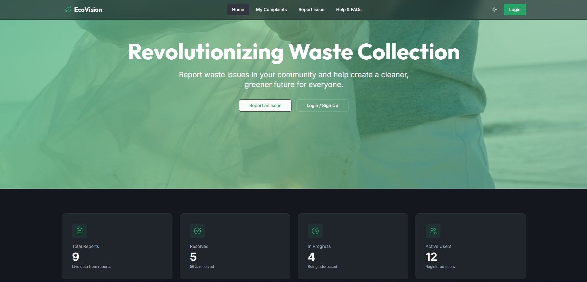
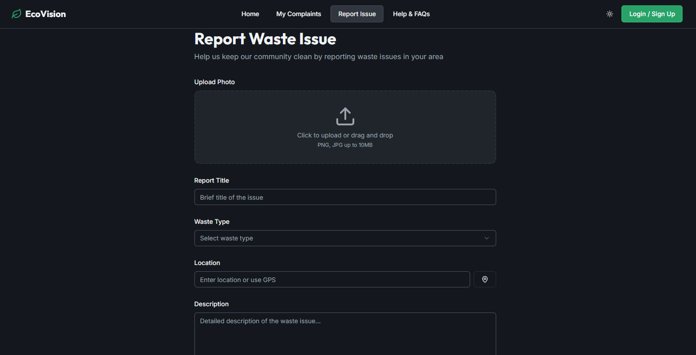
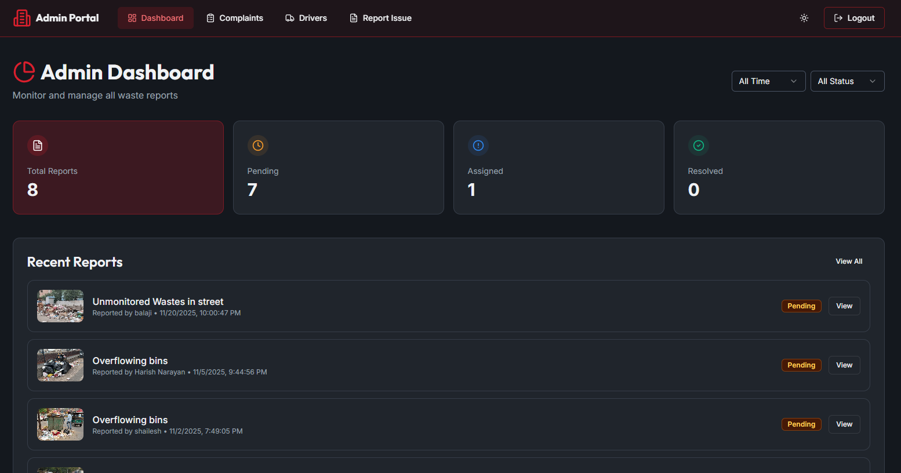
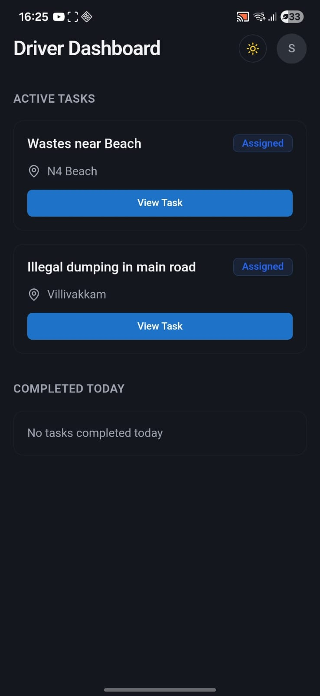
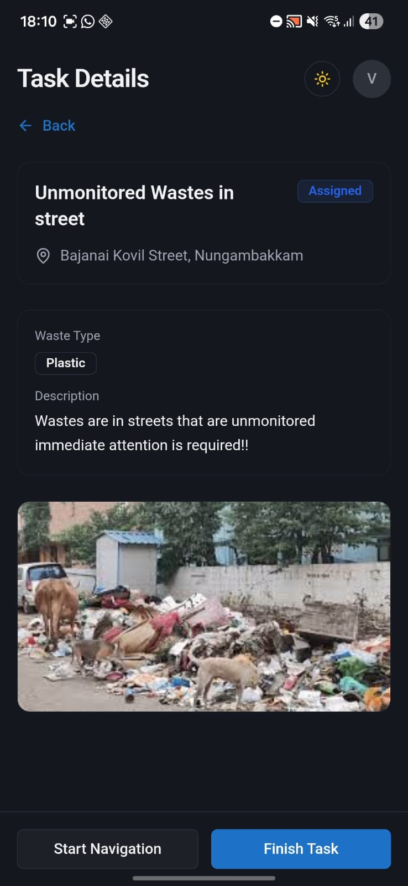

# EcoVision

## A Vision for Cleaner Streets

EcoVision is a smart urban waste management platform designed to improve municipal cleanliness through citizen participation, administrative coordination, and digital task management. The system combines crowdsourced waste reporting, centralized administrative oversight, and mobile-based driver task execution into a unified workflow that promotes accountability, transparency, and efficient waste collection operations.

The platform was developed as a modular multi-tier system consisting of React Progressive Web Applications (PWAs), a Spring Boot authentication service, Strapi CMS for complaint management, and PostgreSQL-based user management.

---

## Project Overview

Rapid urbanization has intensified the challenges associated with municipal solid waste management. Overflowing bins, illegal dumping, delayed complaint resolution, and limited monitoring transparency continue to affect urban sustainability and quality of life.

EcoVision addresses these challenges by enabling citizens to report waste incidents through a Progressive Web Application, allowing administrators to manage and assign complaints, and providing drivers with a dedicated mobile application for task execution and status updates.

Unlike traditional complaint portals, EcoVision introduces a structured workflow connecting citizens, administrators, and field operators through a unified digital ecosystem. The platform is designed to support scalable and data-driven cleanliness management while maintaining a streamlined reporting and assignment workflow.

---

## Problem Statement

Traditional municipal waste management systems often rely on manual reporting procedures and centralized scheduling mechanisms that lead to:

* Delayed complaint resolution
* Lack of transparency in collection workflows
* Limited accountability during task completion
* Inefficient resource allocation
* Absence of predictive monitoring capabilities

Existing civic reporting solutions frequently provide complaint submission features but lack end-to-end verification mechanisms and proactive cleanliness planning.

EcoVision aims to bridge this gap through an integrated citizen reporting, administrative management, and driver task execution platform.

---

## System Architecture

EcoVision follows a modular multi-tier architecture integrating citizen participation, administrative coordination, driver-level execution, and centralized data management.

### Citizen Module (React PWA)

* Waste complaint reporting
* Image uploads
* Complaint tracking
* Mobile-friendly Progressive Web Application

### Admin Module (React PWA)

* Complaint monitoring
* Driver assignment management
* Complaint status tracking
* Operational dashboard

### Driver Module (React PWA + Capacitor)

* Secure authentication
* Assigned task management
* Mobile-first workflow
* Task completion updates

### Spring Boot Backend

* Authentication and authorization
* JWT token management
* Google OAuth integration
* User and role management

### Strapi CMS

* Complaint storage and management
* Driver management
* Content management
* API layer for frontend applications

### Database Layer

* PostgreSQL for authentication and user management
* SQLite for Strapi content storage

---

## Technology Stack

### Frontend

* React
* TypeScript
* Vite
* Tailwind CSS
* Progressive Web Apps (PWA)
* Capacitor

### Backend

* Spring Boot
* Spring Security
* JWT Authentication
* Google OAuth 2.0

### CMS

* Strapi CMS

### Databases

* PostgreSQL
* SQLite

### Additional Technologies

* Google Maps Integration
* Geolocation Services
* REST APIs

---

## Features

### Citizen Features

* Submit waste reports with image evidence
* Track complaint status
* Responsive mobile-friendly experience
* Crowdsourced environmental reporting

### Admin Features

* View and manage reports
* Assign complaints to drivers
* Monitor complaint lifecycle
* Centralized administrative dashboard

### Driver Features

* Secure authentication
* View assigned tasks
* Access task details
* Update task completion status
* Mobile-optimized interface

### Research Features

* Geo-verification architecture using Haversine distance calculations
* AI-based waste hotspot prediction framework
* Spatial clustering concepts for recurring waste detection
* Data-driven cleanliness monitoring

> **Note:** The project includes the architectural foundation for geo-verification using Haversine distance calculations. The enforcement mechanism was intentionally disabled during development and testing phases and serves as a basis for future implementation and evaluation.

---

## AI-Based Waste Hotspot Prediction

To support proactive cleanliness management, EcoVision incorporates a conceptual hotspot prediction framework based on spatial clustering and density-based analysis.

The proposed model analyzes historical waste reports using:

* Geographic clustering techniques
* Density-based risk scoring
* Spatial distribution analysis
* Waste accumulation trend identification

The objective is to help municipal authorities identify recurring waste-prone areas and prioritize preventive interventions before complaints escalate.

---

## Screenshots

### Citizen Module





### Admin Module



### Driver Module





---

## Repository Structure

```text
EcoVision/
├── backend/
├── ecovisionFrontend/
├── eco-vision-driver/
├── ecovision-strapi/
├── screenshots/
├── README.md
└── LICENSE
```

---

## Installation Guide

### 1. Clone Repository

```bash
git clone https://github.com/YOUR_USERNAME/EcoVision.git
cd EcoVision
```

---

## Backend Setup

Navigate to backend:

```bash
cd backend
```

Create a `.env` file in the backend root directory:

```env
DB_URL=jdbc:postgresql://localhost:5432/ecovision_db
DB_USERNAME=your_postgres_username
DB_PASSWORD=your_postgres_password

JWT_SECRET=your_jwt_secret

GOOGLE_CLIENT_ID=your_google_client_id
GOOGLE_CLIENT_SECRET=your_google_client_secret
```

Run the application:

### Linux / macOS

```bash
./mvnw spring-boot:run
```

### Windows

```bash
mvnw.cmd spring-boot:run
```

The backend will start on:

```text
http://localhost:8080
```

---

## Strapi CMS Setup

Navigate to Strapi:

```bash
cd ecovision-strapi
```

Create a `.env` file:

```env
HOST=0.0.0.0
PORT=1337

APP_KEYS=your_app_keys
API_TOKEN_SALT=your_api_token_salt
ADMIN_JWT_SECRET=your_admin_jwt_secret
TRANSFER_TOKEN_SALT=your_transfer_token_salt
JWT_SECRET=your_jwt_secret
```

Install dependencies:

```bash
npm install
```

Run Strapi:

```bash
npm run develop
```

The CMS will start on:

```text
http://localhost:1337
```

---

## Frontend Setup

Navigate to frontend:

```bash
cd ecovisionFrontend
```

Create a `.env` file:

```env
VITE_API_BASE_URL=http://localhost:8080
VITE_STRAPI_API_URL=http://localhost:1337
VITE_STRAPI_API_TOKEN=your_strapi_api_token
```

Install dependencies:

```bash
npm install
```

Run:

```bash
npm run dev
```

---

## Driver Application Setup

Navigate to driver application:

```bash
cd eco-vision-driver
```

Create a `.env` file:

```env
VITE_API_BASE_URL=http://localhost:8080
VITE_STRAPI_API_URL=http://localhost:1337
VITE_STRAPI_API_TOKEN=your_strapi_api_token
```

Install dependencies:

```bash
npm install
```

Run:

```bash
npm run dev
```

---

## Future Enhancements

* Full geo-verification enforcement for task completion
* AI-powered hotspot prediction implementation
* Driver route optimization
* Real-time municipal analytics
* Push notifications and alerts
* Advanced reporting dashboards

---

## License

This project is licensed under the MIT License. See the LICENSE file for details.
